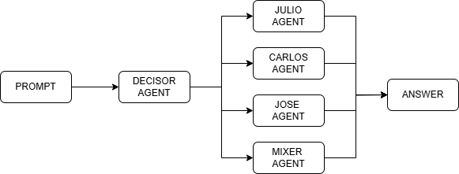

# Sistema de agentes para chatbot de múltiples CVs


Este proyecto implementa un **asistente inteligente** que responde preguntas sobre diferentes CVs (Julio, Jose, Carlos), utilizando:

- **Streamlit** para la interfaz web interactiva.
- **LangChain** para orquestar prompts y agentes.
- **Pinecone** como vector store para recuperación de contexto (RAG).
- **OpenAI API** (vía GitHub Token) como motor de chat.
- **Embeddings de HuggingFace** para procesar los documentos PDF de los CVs.

---

## 🛠 Arquitectura General del Proyecto

A continuación se muestra un esquema general de la arquitectura de agentes utilizada:



El flujo se organiza de la siguiente manera:

- **Decisor**: Analiza la pregunta del usuario y determina a qué CV (o CVs) corresponde.
- **Agentes individuales**: Analizan preguntas específicas para Julio, Jose o Carlos basándose en su propio CV.
- **Mixer**: Si la pregunta involucra más de un CV, este agente combina los contextos de todos los CVs relevantes.
- **Bases vectoriales en Pinecone**: Cada CV tiene su propio índice de vectores, además de un índice combinado para el Mixer.

Todo el sistema funciona utilizando recuperación de información (RAG) + razonamiento asistido, sobre una interfaz amigable desarrollada en **Streamlit**.

---

## 📂 Estructura de Carpetas

```plaintext
nlp2_tp2/
│
├── main.py                  # Código nuevo modularizado
├── main_old.py              # Código original (monolítico)
├── requirements.txt         # Dependencias del proyecto
├── API_KEYS.txt             # Claves GITHUB_TOKEN y PINECONE_API_KEY
│
├── cv/                      # Carpeta con los CVs
│   ├── cv_julio_donadello.pdf
│   ├── cv_jose_martinez.pdf
│   └── cv_carlos_garcia.pdf
│
├── agents/                  # Lógica de construcción de agentes
│   ├── __init__.py
│   ├── agent_factory.py
│   └── prompts.py
│
├── utils/                   # Utilidades generales
│   ├── __init__.py
│   ├── pinecone_utils.py
│   └── common.py
│
├── demo_videos/             # Carpeta con videos de demostración
│   ├── demo_1.mp4
│   ├── demo_2.mp4
│   └── ...

__init__.py vacíos solo para que Python los reconozca como paquetes.
```
---

## 🚀 ¿Cómo correrlo?

Primero asegurate de tener el entorno preparado:

```bash
pip install -r requirements.txt
```

---

### 👉 Para correr el proyecto original (`main_old.py`)

```bash
streamlit run main_old.py
```

Este archivo contiene el flujo monolítico, donde todo el código está en un solo archivo.

---

### 👉 Para correr el proyecto nuevo (`main.py` modularizado)

```bash
streamlit run main.py
```

Este archivo organiza el proyecto de forma limpia en **agentes** y **utilidades** para un flujo mucho más escalable y profesional.

---

## 📹 Videos de demostración

Podés encontrar videos grabados mostrando el funcionamiento en la carpeta:

[📂 Ir a demo_videos/](demo_videos/)

---

## 🔥 Tecnologías utilizadas

- Python 3.10+
- Streamlit
- LangChain
- Pinecone
- HuggingFace Sentence Transformers
- OpenAI API vía Azure
- PyPDF2
- TheFuzz (para pequeñas correcciones de texto)

---

## ✨ Notas importantes

- Si el índice de Pinecone para un CV no existe o está vacío, se carga automáticamente desde los PDFs en `cv/`.
- El agente **Mixer** combina los 3 CVs cuando una pregunta involucra múltiples personas.
- Todo el proyecto está preparado para ser escalable, permitiendo agregar nuevos CVs, agentes y fuentes de datos fácilmente.
- Para considerar un CV particular, se debe especificar el nombre del postulante. Si se especifican dos o más nombres, el sistema lee por defecto todos los CVs.

---
